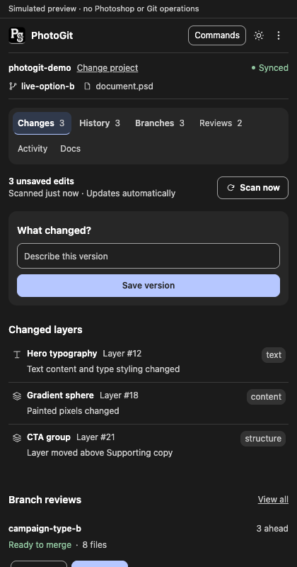

# PhotoGit

Version control for Photoshop. Track supported layer edits, save exact PSD versions, explore branches, and compare changes from a Photoshop panel backed by Git and a local helper.

**Development build (0.2.0).** Not a production release. Keep independent backups of valuable artwork.

## Preview



420 × 800 demo preview using the production stylesheet and simulated data—not a live Photoshop document. See [design and native-host limitations](docs/DESIGN_SYSTEM.md).

## Quick start

Requires Node.js 22+, Git 2.40+, Git LFS, Photoshop, and Adobe UXP Developer Tools. Photoshop 25+ is declared; native testing used 27.10.0. [Compatibility details](docs/COMPATIBILITY.md).

From the repository folder:

```sh
npm ci
npm run build
npm run photogit -- init /absolute/path/to/design-project
npm run helper -- --approve-root /absolute/path/to/design-project
```

Keep the helper running. Load `apps/photoshop-plugin/manifest.json` in UXP Developer Tools, then open **Plugins → PhotoGit → PhotoGit** in Photoshop. Choose your initialized project folder and connect the intended document.

For pairing, Git identity, and troubleshooting, see the [setup guide](docs/QUICK_START.md).

## Workflow

- **Changes:** scan edits and save a named version.
- **History:** inspect versions and open saved PSDs as separate documents.
- **Branches & Reviews:** explore alternatives, compare changes, and merge when safe.
- **Commands & Docs:** navigate with `/history`, save with `/save Refined title` (or `/commit`), and browse the [command directory](docs/COMMANDS.md).

The helper must be running for repository actions. Change detection uses sampled renderings and supported metadata, so it can miss small or unsupported edits. Merging uses ordinary Git with PSD conflict checks—not automatic Photoshop layer blending.

## Development

```sh
npm run check
npm test
npm run verify:security
npm run package:development
npm run verify:package
```

Packaging produces `release/photogit-0.2.0-development.zip`, a development source bundle—not an installable `.ccx` or helper installer. Open `apps/photoshop-plugin/demo.html` for a simulated UI preview.

## Documentation

[Verification & known limitations](docs/ACCEPTANCE_REPORT.md) · [Architecture](docs/ARCHITECTURE.md) · [Security](SECURITY.md) · [Contributing](CONTRIBUTING.md) · [Changelog](CHANGELOG.md) · [Release checklist](docs/RELEASE_CHECKLIST.md)
