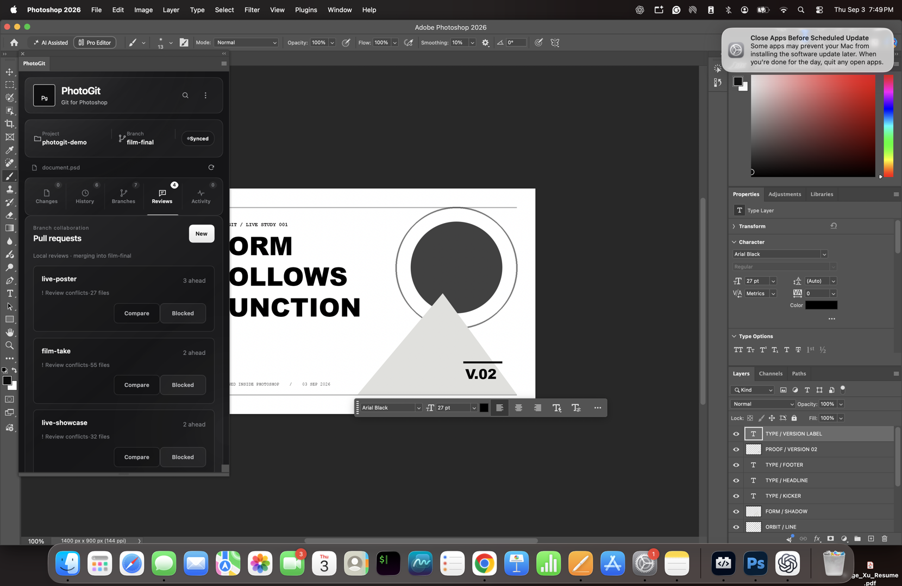

# PhotoGit

PhotoGit is semantic, designer-friendly version control for Photoshop documents. It records supported layer decisions as deterministic JSON while retaining an exact PSD snapshot as the visual artifact and fallback.

This repository is under active development toward a public v1.0 release on September 11, 2026. It is not yet safe for production artwork.

## Photoshop experience



Open **Plugins → PhotoGit → PhotoGit** in Photoshop to reveal the dockable sidebar. For a tools-adjacent workspace, drag the **PhotoGit** panel tab into Photoshop's left dock once; Photoshop owns panel placement and remembers it with the current workspace. Its monochrome workspace maps the workflow into five focused views: semantic Changes, searchable History, design Branches, Reviews, and a transparent Activity log. [Watch the real Photoshop demonstration](artifacts/photogit-demo.mp4).

## Current vertical slice

- Canonical PhotoGit project schema and runtime validation
- Domain-split serialization for document, structure, appearance, and text
- Human-readable semantic diffs
- Deterministic three-way merge planning with explicit conflicts
- Git-backed `init`, `status`, `save`, `diff`, and `log` commands
- Atomic writes, transaction journals, and per-project operation locks
- Approved-root desktop helper with an authenticated project-folder bridge
- Manifest v5 Photoshop panel that captures the active document and sends it to the helper without insecure localhost HTTP

## Development

Requirements: Node.js 22 or newer and Git 2.40 or newer.

```sh
npm install
npm test
npm run check
npm run photogit -- doctor
```

Load `apps/photoshop-plugin` in Adobe UXP Developer Tools for local panel testing. Before packaging a public `.ccx`, replace `com.photogit.development` with the permanent ID issued by Adobe Developer Distribution.

## Safety model

PhotoGit never overwrites the open Photoshop document during capture. Semantic files are written through a transaction and an exact snapshot is supplied separately. Unsupported layer data remains authoritative in that PSD snapshot and is never automatically merged.

## Status

See [docs/IMPLEMENTATION_STATUS.md](docs/IMPLEMENTATION_STATUS.md) for completed work and external validation gates.
