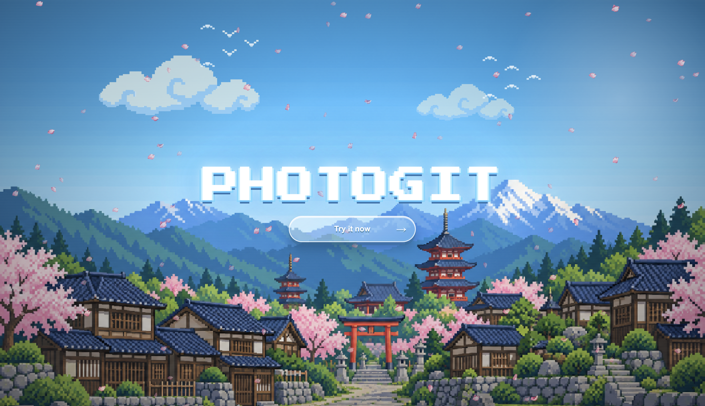

# PhotoGit

Version control for Photoshop. Track supported layer edits, save exact PSD versions, explore branches, and compare changes from a Photoshop panel backed by Git and a local helper.

**Development build (0.2.0).** Not a production release. Keep independent backups of valuable artwork.

## Preview



[Try it now](https://photogit-three.vercel.app/)

## How It Works

PhotoGit serializes your Photoshop document into a domain-split JSON tree under `.photogit/`, instead of versioning the raw PSD as one opaque blob:

| File | Contents | Panel filter |
| --- | --- | --- |
| `document.json` | Canvas size, resolution, color mode, compatibility warnings | — |
| `structure/layers.json` | Layer tree — names, order, parent/child relationships, kind | Structure |
| `appearance/<layer>.json` | Visibility, opacity, blend mode, locks, bounds (one file per layer) | Visual |
| `text/<layer>.json` | Text contents and style fingerprint (text layers only) | Text |
| `content/<layer>.json` | Pixel/raster content fingerprint (one file per layer) | Visual |
| `identities.json` | Tracks each layer's identity across renames/reorders, with a confidence score | — |
| `project.json` | Project-level PhotoGit configuration | — |

Splitting layer data into one JSON file per layer, by domain, means Git can merge edits to different layers — or different properties of the same layer — without conflicting. Edits to the same property of the same layer still need a manual merge decision, same as any other Git conflict.

Change detection checks full-resolution rendered pixels and supported metadata, including brush and eraser edits. Older saved versions retain thumbnail-based comparison until you save a new version to establish the full-resolution baseline. Unsupported layer internals can still require manual review. History shows saved previews, before/after comparisons, and added, deleted, or edited layers. Merging uses ordinary Git with PSD conflict checks — not automatic Photoshop layer blending.

## Installation

Requirements: Node.js 22+, Git 2.40+, Git LFS, Photoshop, and Adobe UXP Developer Tools. Photoshop 25+ is declared; native testing used 27.10.0. See [compatibility details](docs/COMPATIBILITY.md).

```sh
git clone https://github.com/xingexu/photogit.git
cd photogit
npm ci
npm run build
```

There's no published package yet — running `npm run photogit -- ...` and `npm run helper -- ...` from this checkout is the only supported way to use the CLI and helper.

## Usage Guide (Panel — Primary Workflow)

The main way to use PhotoGit is through the panel inside Photoshop. You only need the terminal for one-time project setup.

**One-time setup (Terminal)**

```sh
npm run photogit -- init /absolute/path/to/design-project
npm run helper -- --approve-root /absolute/path/to/design-project
```

Keep the helper running — it's the only process with Git access; the panel talks to it over a paired, Git-ignored bridge and never runs Git itself. Then load `apps/photoshop-plugin/manifest.json` in UXP Developer Tools and open **Plugins → PhotoGit → PhotoGit** in Photoshop. Choose your initialized project folder and connect the intended document.

For pairing, Git identity, and troubleshooting, see the [setup guide](docs/QUICK_START.md).

**Daily workflow (entirely in the panel)**

- **Changes** — scan edits and save a named version
- **History** — inspect versions and open saved PSDs as separate documents
- **Branches & Reviews** — explore alternatives, compare changes, and merge when safe
- **Commands & Docs** — drive everything above from a fixed command dispatcher (never arbitrary code), and browse the [command directory](docs/COMMANDS.md)

## Commands

| Command | Result |
| --- | --- |
| `/changes`, `/history`, `/branches`, `/reviews`, `/activity`, `/docs` | Navigate to that section |
| `/scan` | Scan the connected document for edits |
| `/save Refined title` (or `/commit`) | Save an exact PSD version with that message |
| `/branch cover-b` | Create and switch to a new branch |
| `/switch cover-b` | Switch to a branch and open its saved PSD |
| `/compare cover-b` | Show semantic and file differences against the current branch |
| `/merge cover-b` | Review the comparison and confirm an ordinary Git merge (conflicts stay blocked) |
| `/tag` | Open the tag form |
| `/status` | Inspect project and helper information |
| `/connect` / `/reconnect` | Choose or retry the project's helper connection |
| `/conflicts` | View conflicting files |
| `/pull` / `/push` | Sync with the project's configured remote |

Full details, including message-length limits, are in the [command directory](docs/COMMANDS.md).

## Project Structure

```
photogit/
├── apps/
│   ├── desktop-helper/     # Local helper: the only process with Git access
│   └── photoshop-plugin/   # UXP panel UI — captures Photoshop state, no Git of its own
├── cli/                    # Terminal entry point (init, doctor, ...)
├── packages/
│   ├── schema/             # Versioned semantic model + validators
│   ├── serializer/         # Photoshop state -> domain-split JSON
│   ├── differ/             # Property-level diffs
│   ├── merge-engine/       # Deterministic BASE/OURS/THEIRS merge planning
│   ├── git-engine/         # Safe system-Git adapter (locks, transactions)
│   └── protocol/           # Versioned helper request/response contracts
├── site/                   # Marketing landing page
├── artifacts/              # Design/preview assets
├── scripts/                # Verification, packaging, and demo scripts
└── docs/                   # Architecture, commands, setup, and acceptance docs
```

## Testing

```sh
npm run check
npm test
npm run verify:security
npm run verify:tokens
npm run verify:panel-dom
npm run verify:panel-escaping
npm run verify:assets
npm run package:development
npm run verify:package
```

Each area also has its own focused script — `npm run test:panel-depth`, `npm run test:helper`, `npm run test:engine`, `npm run test:serializer`, and so on — and each runs as its own CI check, so a failure names the functionality rather than the run.

Packaging produces `release/photogit-0.2.0-development.zip`, a development source bundle — not an installable `.ccx` or helper installer. Open `apps/photoshop-plugin/demo.html` for a simulated UI preview.

## Contributing

PhotoGit is pre-release (0.2.0) — discuss large behavior or schema changes in an issue first. See [CONTRIBUTING.md](CONTRIBUTING.md) for the full guidelines, including:

- Live-Photoshop acceptance testing is required for UXP-facing changes ([docs/LIVE_ACCEPTANCE.md](docs/LIVE_ACCEPTANCE.md)) — mocked/browser tests alone don't prove Photoshop correctness
- Never add real artwork, credentials, tokens, or private document metadata to fixtures
- Repository settings, publishing, and merges require maintainer authorization

## Documentation

[Verification & known limitations](docs/ACCEPTANCE_REPORT.md) · [Architecture](docs/ARCHITECTURE.md) · [Security](SECURITY.md) · [Contributing](CONTRIBUTING.md) · [Changelog](CHANGELOG.md) · [Release checklist](docs/RELEASE_CHECKLIST.md)

## License

MIT
